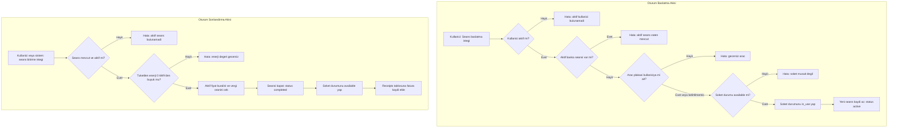
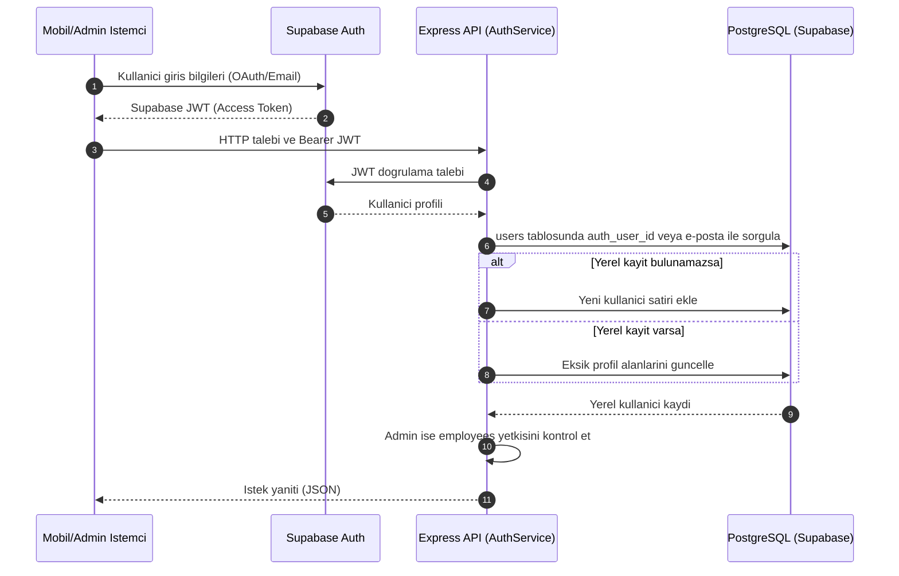
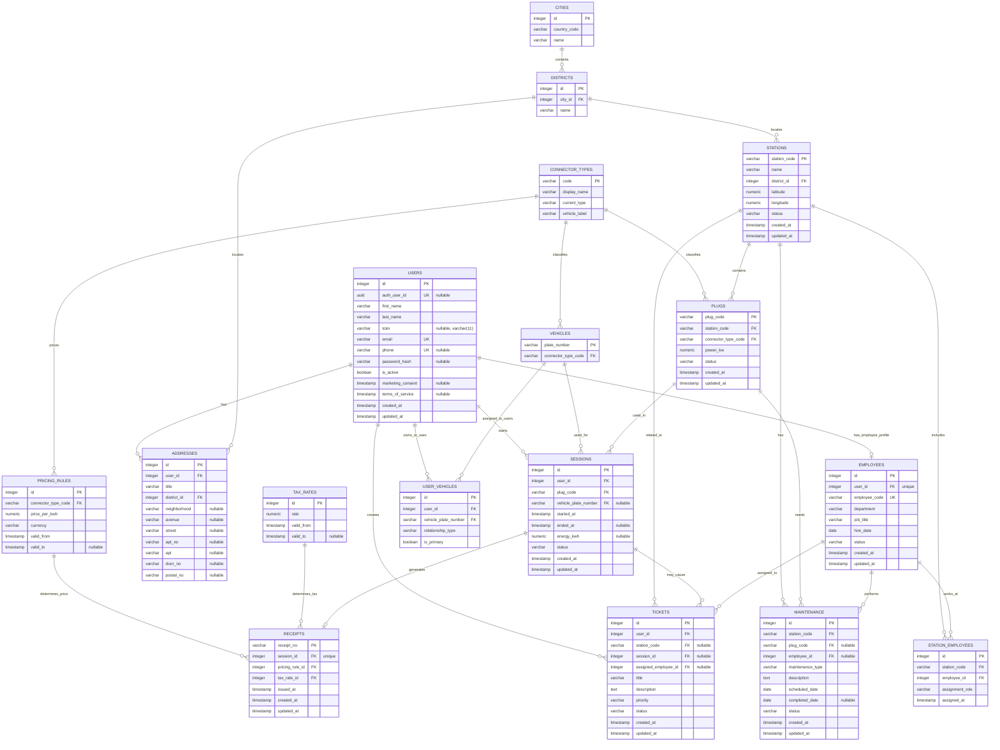

# VoltOps - Elektrikli Araç Şarj İstasyonları Ağı Yönetim Sistemi

Bu doküman, VoltOps projesinin geliştirilmesinde karşılaşılan problemleri, mimari kararları, teknik araştırmaları ve veri tabanı tasarım ayrıntılarını içeren kapsamlı **Proje Raporu** niteliğindedir.

---

## PROJE RAPORU

### Kod Katkıcıları
- Mehmet Burak Dorman, 251307120
- Batuhan Gürsoy, 251307098

### Rehberler
- [Proje esasları ve isterler.](https://drive.google.com/file/d/1jcksmv4zyBqe_OCeBH6PIrWcMghsqQz0/view?usp=sharing)
- [Veritabanı altyapısı nasıl kurulur?](https://docs.google.com/document/d/1c47XBCKIk8ppzKcUsIegOYBHHvTmLNGhnPMATkqBlZs/edit?usp=sharing)
- [Google Stitch ile web-admin (CMS) tasarım çalışması.](https://stitch.withgoogle.com/projects/17619469359769714980)
- [Google Stitch ile mobil uygulama tasarım çalışması.](https://stitch.withgoogle.com/projects/559835388226318948)

### Problem Tanımı
Elektrikli araç (EV) kullanımının hızla artması, şarj istasyonu ağlarının operasyonel yönetimini kritik bir süreç haline getirmiştir. VoltOps projesi kapsamında çözülmesi hedeflenen temel problemler ve sistem gereksinimleri şunlardır:

1. **Varlık ve Altyapı Yönetimi:** Şarj istasyonlarının konumlarının (`stations`), bu istasyonlarda bulunan farklı güç kapasitelerine (`power_kw`) ve akım tiplerine (AC/DC) sahip soketlerin (`plugs`) tek bir sistemden yönetilebilmesi.
2. **Kullanıcı ve Yetki Yönetimi:** Şarj hizmeti alan son kullanıcılar (`users`) ile sistemin işleyişinden ve bakımından sorumlu çalışanların (`employees`) yönetilmesi, admin panel yetkilerinin kontrol edilmesi.
3. **Oturum ve Rezervasyon Kontrolü:** Aynı şarj soketinin aynı anda birden fazla araç tarafından kullanılmasının önlenmesi (double-booking engelleme), seans başlatma ve bitirme işlemlerinin atomik olarak gerçekleştirilmesi.
4. **Fiyatlandırma ve Faturalandırma:** Zamanla değişen fiyat kurallarının (`pricing_rules`) ve vergi oranlarının (`tax_rates`) geriye dönük veri tutarlılığını bozmadan yönetilmesi, tamamlanan şarj seanslarına bağlı olarak otomatik fatura (`receipts`) oluşturulması.
5. **Operasyonel Destek ve Bakım:** İstasyonlarda meydana gelen arızaların giderilmesi için teknik ekiplerin atanması (`maintenance`) ve kullanıcıların yaşadığı sorunlar için destek talebi oluşturabilmesi (`tickets`).

Bu karmaşık ilişkilerin güvenli, hızlı ve tutarlı bir şekilde yönetilmesi için ilişkisel veri tabanı tasarımı veri bütünlüğünün odağı haline getirilmiştir.

---

### Yapılan Araştırmalar
Proje geliştirme sürecinde çeşitli mimari ve teknik kararlar, doğrudan karşılaşılan sorunlar üzerinden araştırılarak şekillendirilmiştir.

#### Monorepo Yapısı ve Paket Yönetimi
Projenin üç ayrı uygulama içermesi (API, web yönetici paneli, mobil uygulama) nedeniyle tek bir depo üzerinde bağımlılıkları tutarlı yönetebilmek için monorepo mimarisi incelenmiştir. Nx ve Turborepo gibi çözümler değerlendirilmiş; ancak bu projenin ölçeği için yönetim karmaşıklığı yarattığı görülmüştür. Workspace desteği ve disk alanı verimliliği göz önüne alınarak pnpm workspaces tercih edilmiştir [13].

#### Backend Framework Seçimi
İlk prototipte NestJS kullanılmıştır. Ancak NestJS'in modül sistemi ve bağımlılık enjeksiyon katmanının bu projenin ihtiyaç duyduğu endpoint yoğunluğu için gereksiz soyutlama maliyeti yarattığı görülmüştür. Express.js'e geçişle birlikte aynı işlevsellik çok daha az kod ve yapılandırmayla elde edilmiş; geliştirme ve hata ayıklama döngüsü hızlanmıştır [5] [16] [17].

#### Veritabanı Bağlantı Sorunları
Supabase Postgres'e doğrudan bağlanılmaya çalışıldığında, AWS eu-central-1 bölgesinin yalnızca IPv6 adresi dönüşü nedeniyle yerel geliştirme ortamından erişim sağlanamadığı tespit edilmiştir. Supabase'in sunduğu session pooler ve transaction pooler seçenekleri karşılaştırılmış; uzun süreli API işlemleri için session pooler'ın uygun olduğu, ancak migrate işlemleri için doğrudan bağlantının gerektiği anlaşılmıştır [3]. SSL zorunluluğu ve bağlantı parametrelerinin doğru yapılandırılması bu araştırma sürecinin çıktısıdır [1].

#### Kimlik Doğrulama Mimarisi
Supabase Auth kullanımında istemcilerin iş tablolarına (sessions, tickets vb.) doğrudan erişmesi yerine Express API'nin tek iş verisi sınırı olarak tanımlanmasına karar verilmiştir. Bu kararın temelinde Row Level Security (RLS) politikalarının sunucu tarafında tek noktada kontrol edilmesi [2] ve JWT token'ının yalnızca Express'te doğrulanarak kullanıcı kimliğinin istemci parametrelerine bağımlı olmaması yatmaktadır. İlk girişte public.users tablosuna satır oluşturulmaması sorunuyla karşılaşılmış; Supabase Auth tetikleyicisinin yokluğu araştırılmış ve kayıt akışına servis katmanında açık bir kayıt adımı eklenmiştir [1].

#### Mobil Deep Link ve OAuth Yönlendirmesi
Expo Go ile geliştirme buildleri arasında OAuth callback URL şemasının farklılaşması (exp:// ve voltops://) beklenmedik bir sorun olarak ortaya çıkmıştır. Expo Router'ın bağlantı çözümleme davranışı [7] ve Supabase Dashboard'daki yönlendirme URL izin listesi araştırılmış [4]; her iki şema için ayrı kayıt yapılması gerektiği belirlenmiştir. Expo Linking kütüphanesinin deep link yaşam döngüsü de bu süreçte incelenmiştir [8].

#### ORM Seçimi
TypeScript ile PostgreSQL kullanımında Prisma, TypeORM ve Drizzle ORM değerlendirilmiştir. Prisma'nın runtime bağımlılığı ve sorgu motorunun ayrı bir binary gerektirmesi container imaj boyutunu olumsuz etkilediğinden Drizzle ORM tercih edilmiştir [6]. Drizzle'ın şema tanımını doğrudan TypeScript'te tutması ve ürettiği SQL'in öngörülebilir olması da bu kararda belirleyici olmuştur [17].

#### Frontend Framework Değişikliği
Yönetici paneli başlangıçta Next.js üzerine kurulmuştu. Panel yalnızca kimlik doğrulamalı kullanıcılara hizmet veren ve SEO gerektirmeyen dahili bir SPA olduğundan, sunucu tarafı render getirisi olmayan Next.js yerine Vite + React tercih edilmiştir [11]. Sayfa yönlendirmesi için React Router kullanılmış [12], stil katmanında ise TailwindCSS ve NativeWind benimsenmiştir [15] [10]. Bu değişiklik derleme süresini belirgin biçimde kısaltmıştır. Mobil uygulama ise React Native ve Expo ekosistemi üzerine inşa edilmiştir [9] [7].

---

### Akış Şeması
Projedeki kritik iş mantıklarının süreç yönetimini gösteren iki ana akış şeması aşağıda belirtilmiştir:

#### 1. Şarj Oturumu Yaşam Döngüsü (Start & End Session)
Bu şema, bir kullanıcının şarj istasyonunda oturum başlatması ve bitirmesi süreçlerinin veri tabanı seviyesindeki kontrol adımlarını göstermektedir.



#### 2. Kimlik Doğrulama ve Kullanıcı Eşitleme Akışı (Auth & Sync)
Bu şema, mobil ve yönetici istemcilerinin kimlik doğrulama süreçleri ve yerel Postgres veritabanı ile nasıl senkronize edildiklerini gösterir.



---

### Yazılım Mimarisi
VoltOps projesi, monorepo mimarisi kullanılarak geliştirilmiş ve servislerin birbirleriyle temiz sınırlar üzerinden konuşması sağlanmıştır.

```
 Kök Dizin (Root)
 ├── apps/
 │   ├── api/             --> Node.js & Express REST API (İş mantığı katmanı)
 │   ├── web-admin/       --> Vite + React SPA (Yönetici Paneli)
 │   └── mobile/          --> Expo + React Native & NativeWind (Sürücü Uygulaması)
 └── packages/
     ├── database/        --> ERD, Drizzle şemaları ve migration yardımcıları
     ├── types/           --> Paylaşılan ortak TypeScript tipleri ve arayüzleri
     └── utils/           --> Ortak yardımcı kütüphaneler
```

- **İş Sınırları Kuralı:** İstemciler (mobil ve yönetici paneli) doğrudan Supabase Postgres tablosuna SQL sorgusu atamazlar veya Supabase REST API'sini veri tabanı mutasyonları için doğrudan kullanamazlar. Tüm işlemler, Row-Level Security (RLS) politikaları gereği Express API katmanından geçmek zorundadır.
- **ORM Katmanı:** SQL şeması Drizzle ORM kullanılarak TypeScript ile tanımlanmış olup, `drizzle-kit` yardımıyla migrations SQL'leri otomatik üretilir.

---

### Veri Tabanı Diyagramı
Sistemde kullanılan varlık ilişkileri (ERD) aşağıdaki Mermaid diyagramında detaylandırılmıştır. Veri tabanında veri tekrarını önlemek için yüksek düzeyde normalizasyon yapılmıştır (Örneğin; soketlerin anlık durumları dinamik tutulurken, vergi ve fiyat oranları ilişkili tablolardan run-time'da join edilmektedir).



---

### Genel Yapı
Sistem, ilişkisel veri tabanı tasarımı ve veri bütünlüğü mekanizmalarını ön plana çıkaracak şekilde modellenmiştir. Veri bütünlüğünü, sorgu performansını ve operasyonel güvenliği en üst düzeye çıkarmak amacıyla **INDEX**, **VIEW**, **TRIGGER** ve **STORED PROCEDURE** özellikleri amacına uygun olarak tasarlanmış ve sisteme entegre edilmiştir.

#### 1. INDEX (İndeksler)
Büyük veri tablolarında sorguların performanslı çalışması, yabancı anahtarlar üzerinden yapılan JOIN işlemlerinin hızlandırılması ve mantıksal kısıtlamaların veri tabanı seviyesinde zorlanması için indekslerden yararlanılmıştır.

*   **Tekil İndeksler (Unique Indexes):** Kullanıcı e-postalarının (`users_email_unique`) ve telefon numaralarının (`users_phone_unique`) mükerrer kaydolmasını önler.
*   **Bileşik İndeksler (Composite Indexes):** `user_vehicles_user_vehicle_unique` bileşik indeksi, bir kullanıcının (`user_id`) aynı plakalı aracı (`vehicle_plate_number`) kendi profiline yalnızca bir kez ekleyebilmesini garanti eder.
*   **Kısmi İndeksler (Partial Indexes):**
    ```sql
    CREATE UNIQUE INDEX "sessions_active_user_unique" ON "sessions" USING btree ("user_id") WHERE "sessions"."status" = 'active';
    ```
    *Amaç:* Bir kullanıcının aynı anda birden fazla aktif şarj oturumu başlatmasını engellemek için mükemmel bir yöntemdir. Eğer kullanıcı yeni bir aktif seans başlatmaya çalışırsa ve zaten `status = 'active'` olan bir satırı varsa veri tabanı bu benzersizlik ihlaliyle işlemi doğrudan reddeder.

#### 2. VIEW (Görünümler)
İstemci tarafında karmaşık JOIN sorguları yazılmasını engellemek ve güvenlik sınırlarını korumak amacıyla iki kritik SQL görünümü (`VIEW`) tanımlanmıştır. Bu görünümler hem `anon` hem de `authenticated` rolleri için `SELECT` yetkisine sahiptir.

*   **`public.view_station_catalog`:**
    ```sql
    CREATE OR REPLACE VIEW public.view_station_catalog AS
    SELECT
        stations.station_code,
        stations.name AS station_name,
        stations.status AS station_status,
        stations.latitude,
        stations.longitude,
        cities.country_code,
        cities.name AS city_name,
        districts.name AS district_name,
        count(plugs.plug_code)::integer AS total_plugs,
        count(plugs.plug_code) FILTER (WHERE plugs.status = 'available')::integer AS available_plugs,
        count(plugs.plug_code) FILTER (WHERE plugs.status = 'fault')::integer AS faulty_plugs,
        coalesce(max(plugs.power_kw), 0)::numeric(8, 2) AS max_power_kw,
        array_remove(array_agg(DISTINCT connector_types.code), NULL) AS connector_type_codes
    FROM public.stations
    INNER JOIN public.districts ON stations.district_id = districts.id
    INNER JOIN public.cities ON districts.city_id = cities.id
    LEFT JOIN public.plugs ON plugs.station_code = stations.station_code
    LEFT JOIN public.connector_types ON plugs.connector_type_code = connector_types.code
    GROUP BY stations.station_code, stations.name, stations.status, stations.latitude, stations.longitude, cities.country_code, cities.name, districts.name;
    ```
    *Amaç:* Mobil uygulamada kullanıcılara istasyon haritası listelenirken, o istasyondaki toplam soket sayısı, müsait soket sayısı, arızalı soket sayısı, maksimum güç kapasitesi ve desteklenen soket tipleri (CCS, Type 2 vb.) tek bir hamlede okunabilir. Client-side join maliyetini ve veri ağ trafiğini sıfıra indirir.

*   **`public.view_connector_pricing`:**
    *Amaç:* Zamana bağlı geçerliliği olan fiyat kuralları (`pricing_rules`) ve vergi oranlarını (`tax_rates`) `now()` ile karşılaştırarak şu anda aktif olan birim fiyatları ve vergi katsayısını istemciye tek bir satırda döner. Zaman filtresi sorgularının karmaşıklığı sunucuda çözülür.

#### 3. TRIGGER (Tetikleyiciler)
Uygulama sunucusundaki kodların (Express API) veri güncellemelerini kaçırmaması ve otomatik oluşturulması gereken alanların güvenliği için tetikleyiciler kullanılmıştır.

*   **`users_set_updated_at` (ve diğer tablolar):**
    Tablolardaki satırlar her güncellendiğinde `updated_at` kolonunu otomatik olarak o anki zaman damgasıyla günceller.
*   **`employees_set_employee_code`:**
    ```sql
    CREATE OR REPLACE FUNCTION public.set_employee_code()
    RETURNS trigger LANGUAGE plpgsql AS $$
    BEGIN
        IF NEW.employee_code IS NULL OR btrim(NEW.employee_code) = '' THEN
            NEW.employee_code = 'EMP-' || lpad(NEW.id::text, 4, '0');
        END IF;
        RETURN NEW;
    END;
    $$;
    ```
    *Amaç:* Şirkete yeni katılan bir personel (`employees`) sisteme girildiğinde eğer bir personel kodu verilmemişse, sistem personelin benzersiz ID değerini alıp `EMP-0001` formatında otomatik bir sicil kodu olarak atar.

#### 4. STORED PROCEDURE (Saklı Yordamlar)
Şarj istasyonu oturum süreçleri gibi çoklu tablolarda güncelleme ve doğrulama gerektiren operasyonel işlemler, veri bütünlüğünü korumak adına saklı yordamlar üzerinden atomik birer `transaction` olarak çalıştırılır.

*   **`public.proc_start_session`:**
    *   *Doğrulamalar:* Kullanıcının aktifliği, başka aktif oturumunun olup olmadığı, seçilen soketin veritabanındaki durumu kontrol edilir.
    *   *Atomik claim:* Soket durumu `'available'` ise tek bir sorguyla `'in_use'` durumuna çekilir. Bu işlem esnasında oluşabilecek çakışmalar (iki kişinin aynı anda aynı soketi seçmesi) engellenir.
    *   *Sonuç:* Başarılı ise yeni bir seans (`sessions`) kaydı açar ve geriye `session_id` döner.

*   **`public.proc_end_session`:**
    *   *Doğrulamalar:* Seansın aktifliği doğrulanır. Enerji tüketiminin pozitif bir sayı olduğu doğrulanır.
    *   *Fiyat ve Vergi Belirleme:* Seansa ait soketin şarj tipine göre güncel geçerli fiyat kuralı (`pricing_rules`) ve vergi katsayısı (`tax_rates`) bulunur.
    *   *Atomik sonlandırma:* Seans durumunu `'completed'` yapar ve soketi tekrar `'available'` durumuna günceller.
    *   *Fatura Oluşturma:* Oturuma ait fiyat kuralı ve vergi oranını kilitleyen, fatura numarası otomatik hesaplanmış (`R-` ön ekli) yeni bir `receipts` kaydı ekler.

---

### Referanslar
[1] Supabase, Supabase Documentation, https://supabase.com/docs

[2] Supabase, Row Level Security, https://supabase.com/docs/guides/auth/row-level-security

[3] Supabase, Connection Pooling, https://supabase.com/docs/guides/database/connecting-to-postgres#connection-pooler

[4] Supabase, Auth with Expo (React Native), https://supabase.com/docs/guides/auth/social-login/auth-google?queryGroups=platform&platform=react-native

[5] Express.js, Express 5.x API Reference, https://expressjs.com/en/5x/api.html

[6] Drizzle Team, Drizzle ORM Documentation, https://orm.drizzle.team/docs/overview

[7] Expo, Expo Router Documentation, https://docs.expo.dev/router/introduction

[8] Expo, Expo Linking — Deep Links, https://docs.expo.dev/guides/linking

[9] React Native, React Native Documentation, https://reactnative.dev/docs/getting-started

[10] NativeWind, NativeWind v4 Documentation, https://www.nativewind.dev/v4/overview

[11] Vite, Vite Guide, https://vite.dev/guide

[12] React Router, React Router v7 Documentation, https://reactrouter.com/start/library/installation

[13] pnpm, Workspaces, https://pnpm.io/workspaces

[14] Docker Inc., Docker Compose Documentation, https://docs.docker.com/compose

[15] Tailwind CSS, Tailwind CSS v4 Documentation, https://tailwindcss.com/docs/installation

[16] OpenJS Foundation, Node.js Documentation, https://nodejs.org/en/docs

[17] Microsoft, TypeScript Handbook, https://www.typescriptlang.org/docs/handbook
