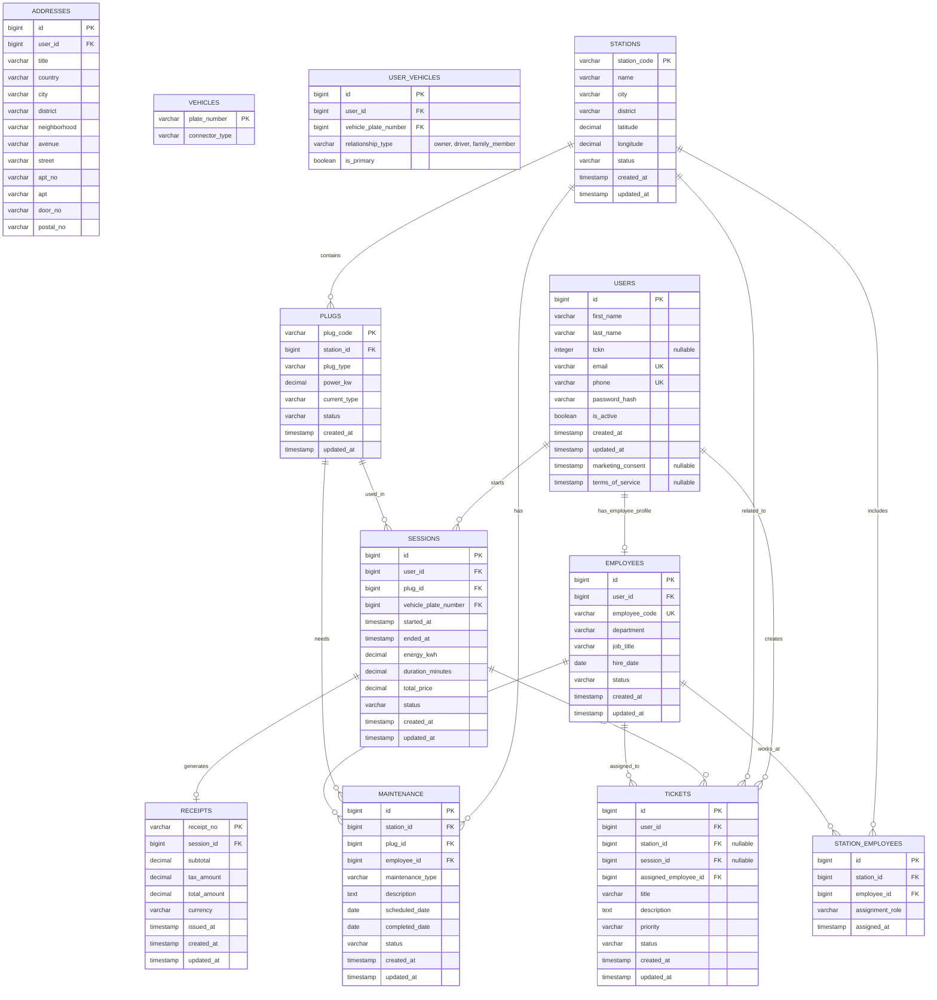

```mermaid
erDiagram

    %% =========================
    %% IDENTITY
    %% =========================

    USERS {
        bigint id PK
        varchar first_name
        varchar last_name
        integer tckn "nullable"
        varchar email UK
        varchar phone UK
        varchar password_hash
        boolean is_active
        timestamp created_at
        timestamp updated_at
        timestamp marketing_consent "nullable"
        timestamp terms_of_service "nullable"
    }

    EMPLOYEES {
        bigint id PK
        bigint user_id FK
        varchar employee_code UK
        varchar department
        varchar job_title
        date hire_date
        varchar status
        timestamp created_at
        timestamp updated_at
    }

    STATION_EMPLOYEES {
        bigint id PK
        bigint station_id FK
        bigint employee_id FK
        varchar assignment_role
        timestamp assigned_at
    }

    ADDRESSES {
        bigint id PK
        bigint user_id FK
        varchar title
        varchar country
        varchar city
        varchar district
        varchar neighborhood
        varchar avenue
        varchar street
        varchar apt_no
        varchar apt
        varchar door_no
        varchar postal_no
    }

    %% =========================
    %% VEHICLES
    %% =========================

    VEHICLES {
        varchar plate_number PK
        varchar connector_type
    }

    USER_VEHICLES {
        bigint id PK
        bigint user_id FK
        bigint vehicle_plate_number FK
        varchar relationship_type "owner, driver, family_member"
        boolean is_primary
    }

    %% =========================
    %% CHARGING OPERATIONS
    %% =========================

    STATIONS {
        varchar station_code PK
        varchar name
        varchar city
        varchar district
        decimal latitude
        decimal longitude
        varchar status
        timestamp created_at
        timestamp updated_at
    }

    PLUGS {
        varchar plug_code PK
        bigint station_id FK
        varchar plug_type
        decimal power_kw
        varchar current_type
        varchar status
        timestamp created_at
        timestamp updated_at
    }

    SESSIONS {
        bigint id PK
        bigint user_id FK
        bigint plug_id FK
        bigint vehicle_plate_number FK
        timestamp started_at
        timestamp ended_at
        decimal energy_kwh
        decimal duration_minutes
        decimal total_price
        varchar status
        timestamp created_at
        timestamp updated_at
    }

    RECEIPTS {
        varchar receipt_no PK
        bigint session_id FK
        decimal subtotal
        decimal tax_amount
        decimal total_amount
        varchar currency
        timestamp issued_at
        timestamp created_at
        timestamp updated_at
    }

    %% =========================
    %% SUPPORT & MAINTENANCE
    %% =========================

    MAINTENANCE {
        bigint id PK
        bigint station_id FK
        bigint plug_id FK
        bigint employee_id FK
        varchar maintenance_type
        text description
        date scheduled_date
        date completed_date
        varchar status
        timestamp created_at
        timestamp updated_at
    }

    TICKETS {
        bigint id PK
        bigint user_id FK
        bigint station_id FK "nullable"
        bigint session_id FK "nullable"
        bigint assigned_employee_id FK
        varchar title
        text description
        varchar priority
        varchar status
        timestamp created_at
        timestamp updated_at
    }

    %% =========================
    %% RELATIONSHIPS
    %% =========================

    USERS ||--o| EMPLOYEES : has_employee_profile
    USERS ||--o{ SESSIONS : starts
    USERS ||--o{ TICKETS : creates

    STATIONS ||--o{ PLUGS : contains
    STATIONS ||--o{ MAINTENANCE : has
    STATIONS ||--o{ TICKETS : related_to
    STATIONS ||--o{ STATION_EMPLOYEES : includes

    PLUGS ||--o{ SESSIONS : used_in
    PLUGS ||--o{ MAINTENANCE : needs

    SESSIONS ||--o| RECEIPTS : generates
    SESSIONS ||--o{ TICKETS : may_cause

    EMPLOYEES ||--o{ MAINTENANCE : performs
    EMPLOYEES ||--o{ TICKETS : assigned_to
    EMPLOYEES ||--o{ STATION_EMPLOYEES : works_at
```