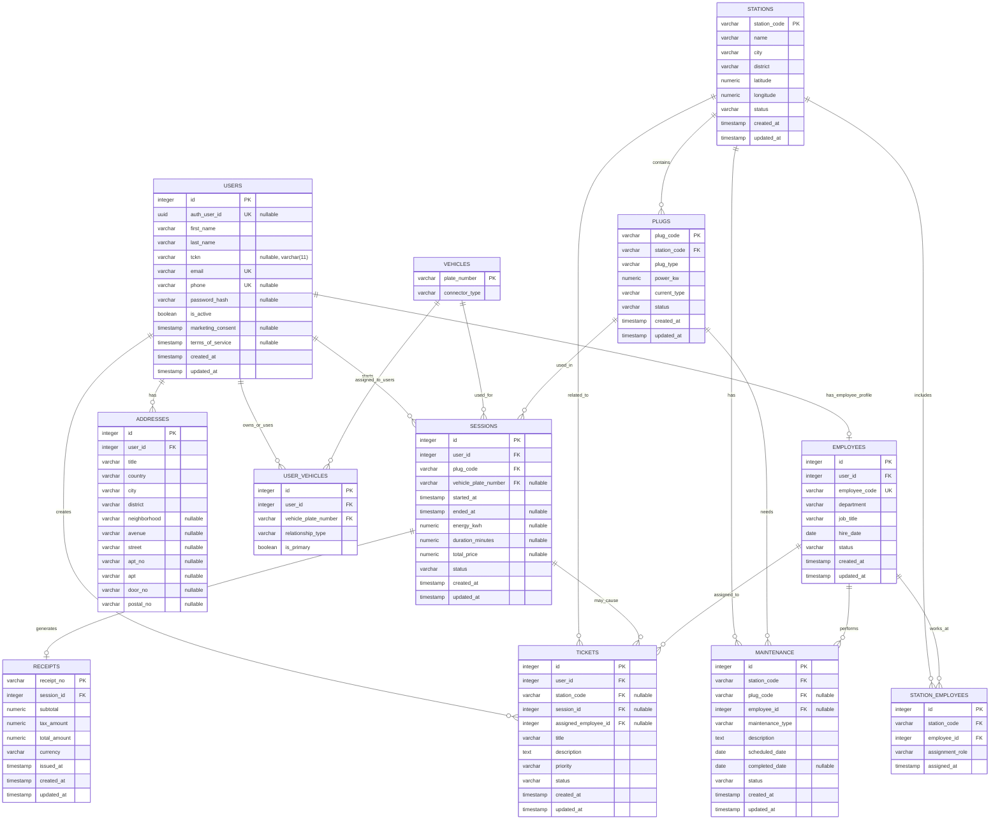

# VoltOps Database Schema

Canonical source: `apps/api/src/db/schema.ts` and generated migrations in `apps/api/drizzle/`.

## Canonical Constraints

- Unique indexes: `users_auth_user_id_unique`, `users_email_unique`, `users_phone_unique`, `employees_employee_code_unique`.
- Composite unique index: `user_vehicles_user_vehicle_unique` on `(user_id, vehicle_plate_number)`.
- Partial unique index: `sessions_active_user_unique` on `user_id` where `status = 'active'`.
- Foreign keys use natural station and plug keys: `station_code`, `plug_code`, and `vehicle_plate_number`.
- `phone`, `password_hash`, `auth_user_id`, `tckn`, `vehicle_plate_number`, `ended_at`, session totals, optional maintenance/ticket assignments, and optional address detail fields are nullable.

## Security Notes

- Row Level Security is enabled on all app tables by migration `0002_pink_iceman.sql`.
- Direct public reads from `stations` and `plugs` are revoked for `anon` and `authenticated`; clients should use the Express API for business data.
