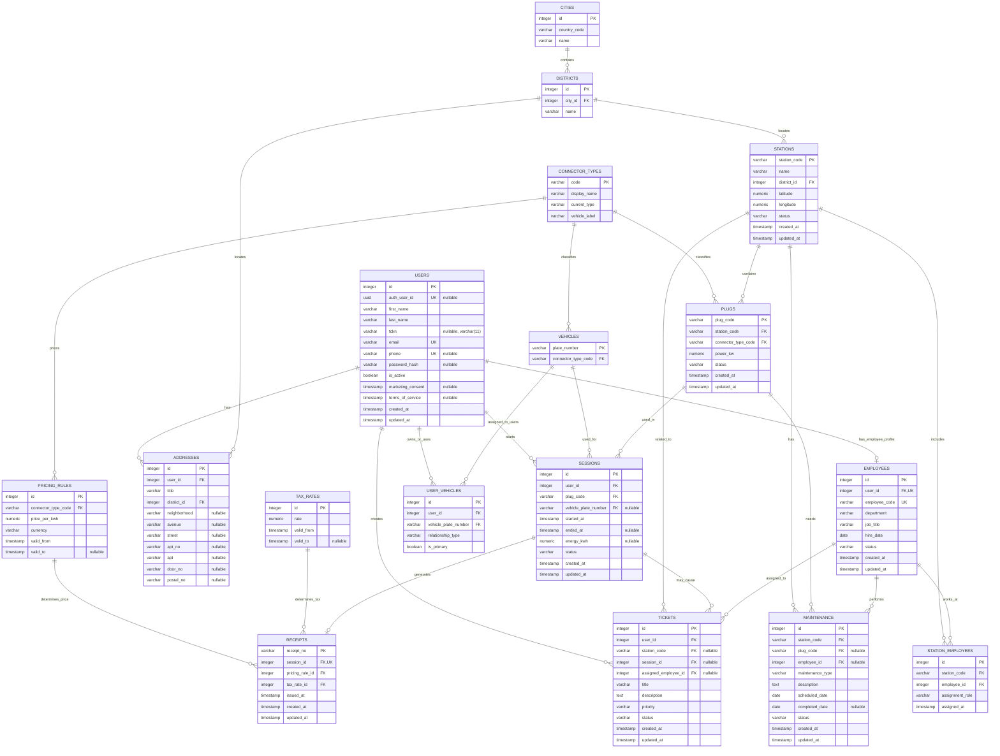

# VoltOps Database Schema

Canonical source: `apps/api/src/db/schema.ts` and generated migrations in `apps/api/drizzle/`.

The physical database is normalized: connector labels, current type, geography, pricing, tax, session duration, and receipt totals are not stored redundantly in operational rows. API services preserve legacy response names by computing or joining those values on read.

## Canonical Constraints

- Unique indexes: `users_auth_user_id_unique`, `users_email_unique`, `users_phone_unique`, `employees_employee_code_unique`, `employees_user_id_unique`, `receipts_session_id_unique`, `cities_country_name_unique`, `districts_city_name_unique`, `pricing_rules_connector_valid_from_unique`, and `tax_rates_valid_from_unique`.
- Composite unique index: `user_vehicles_user_vehicle_unique` on `(user_id, vehicle_plate_number)`.
- Partial unique index: `sessions_active_user_unique` on `user_id` where `status = 'active'`.
- Foreign keys use natural station, plug, and vehicle keys where those are the table identity: `station_code`, `plug_code`, and `vehicle_plate_number`.
- `connector_types` owns plug API labels (`plugType`, `currentType`) and mobile vehicle labels. `vehicles` and `plugs` store only `connector_type_code`.
- `pricing_rules` and `tax_rates` are time-versioned determinants. `receipts` stores only the chosen `pricing_rule_id` and `tax_rate_id`; `subtotal`, `taxAmount`, `totalAmount`, and `currency` are computed through joins.
- `sessions` stores only event facts. `durationMinutes` is computed from `started_at` and `ended_at`; `totalPrice` is computed from `energy_kwh`, pricing, and tax when a receipt exists.
- `stations` and `addresses` store `district_id`; city, district, and country code are resolved through `districts` and `cities`.
- Nullable columns: `phone`, `password_hash`, `auth_user_id`, `tckn`, `vehicle_plate_number`, `ended_at`, `energy_kwh`, optional maintenance/ticket assignments, pricing/tax `valid_to`, and optional address detail fields.

## Seeded Lookup Rows

- `connector_types`: `AC_TYPE2`, `DC_CCS2`, `DC_CHADEMO`, `DC_GB_T`.
- Initial `pricing_rules`: all connectors at `7.5000 TRY/kWh`, valid from `1970-01-01T00:00:00Z`.
- Initial `tax_rates`: `0.2000`, valid from `1970-01-01T00:00:00Z`.

## Database Interfaces

- Public read views: `view_station_catalog` and `view_connector_pricing`.
- Session lifecycle procedures used by the Express API: `proc_start_session` and `proc_end_session`.
- Trigger functions: `set_updated_at` and `set_employee_code`.
- Timestamp triggers maintain `updated_at` on app tables that expose that column. The employee-code trigger fills `employee_code` as `EMP-XXXX` when omitted.
- Utility scripts:
  - `pnpm --filter @voltops/api db:seed`
  - `pnpm --filter @voltops/api db:reset-seed -- --force`
  - `pnpm --filter @voltops/api db:verify`

## Security Notes

- Row Level Security is enabled on app tables by migration `0002_pink_iceman.sql`.
- Migration `0006_closed_red_skull.sql` enables Row Level Security on `cities`, `districts`, `connector_types`, `pricing_rules`, and `tax_rates`.
- Direct public reads from app tables are revoked for `anon` and `authenticated`; clients should use the Express API for business data.
- `anon` and `authenticated` can select only the two non-sensitive public views. They cannot execute session lifecycle procedures directly.
